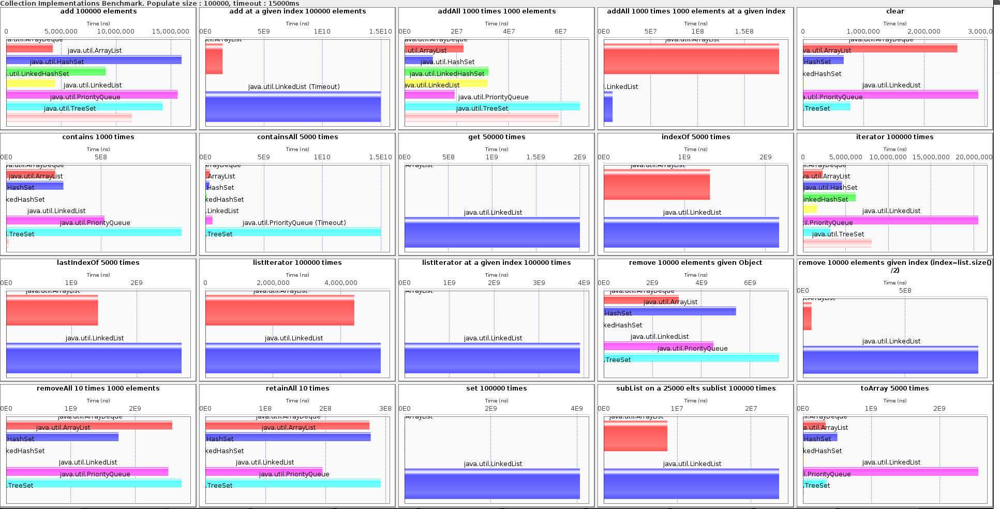
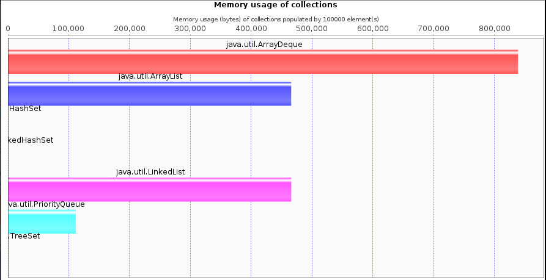

# Java Collections Framework Benchmark Tool

Developed for test purposes with old code base from Leo Lewis.

The performance of data structures, especially collections, 
is a recurrent subject when coding. If you have never heard about such a topic, 
here is the chance, otherwise it's the hundredth time you'll have seen such title, 
and you are probably thinking "Another article about this topic, 
I'll probably not learn anything new, but anyway I'm bored so I'm going to read it …". 
Furthermore, you are probably 90% right, nothing new here, 
but I promise you a couple of colorful and 
beautiful charts that we do not have the opportunity to see every day 
(and the ability to create your own).

The first time I started wondering about collection performances was 
when I started working with some > 100 000 elements collections. 
At that time, I heard some bad jokes such as, 
"I just understood why the Java logo is a cup of coffee because 
Java collections are so slow that when manipulating them, 
you have the time to go and grab some coffee before they do the job.
At that time, I want to use the implementation of a java.util.List that 
would have good performances on all the standard methods provided by the interface 
(let's say get(index), add(Object), remove(Object), remove(index), contains(Object), 
iterator(), add other methods that you like), without wondering about memory usage 
(I mean, even this List would take 4 times the size of a LinkedList 
it wouldn't be a big deal).

In other words, some List that would not be instantiated a million times 
in my application, but a couple of times and each instance 
will have great performances. For example, the model of a GUI Table, 
or some other GUI component, which data will evolve frequently, 
and which performances will sometimes be critical.


To build this project use

```
    mvn install
```

To run this project from within Maven use

```
    mvn compile exec:java
```

For more help see the Apache Camel documentation: http://camel.apache.org/

### Old Code Base Output (from Leo Lewis blog post):


Source: https://dzone.com/articles/java-collection-performance

## Chart Output

New Code Base Output:





## Command-Line Output:

```
Performances of java.util.ArrayList populated with 100000 elt(s)
~~~~~~~~~~~~~~~~~~~~~~~~~~~~~~~~~~~~~~~~~~~~~~~~~~~
add 100000 elements ... 15991217ns
remove 10000 elements given Object ... 5426314888ns
addAll 1000 times 1000 elements ... 10861806ns
contains 1000 times ... 301962278ns
removeAll 10 times 1000 elements ... 1743028542ns
iterator 100000 times ... 4570050ns
containsAll 5000 times ... 346839133ns
toArray 5000 times ... 504588649ns
clear ... 673839ns
retainAll 10 times ... 275205804ns
add at a given index 100000 elements ... 1477476406ns
addAll 1000 times 1000 elements at a given index ... 186632322ns
get 50000 times ... 1451798ns
indexOf 5000 times ... 1313715912ns
lastIndexOf 5000 times ... 1407463167ns
set 100000 times ... 7484876ns
subList on a 25000 elts sublist 100000 times ... 8649746ns
listIterator 100000 times ... 4402839ns
listIterator at a given index 100000 times ... 5284674ns
remove 10000 elements given index (index=list.size()/2) ... 42391320ns
Benchmark done in 14.455s
~~~~~~~~~~~~~~~~~~~~~~~~~~~~~~~~~~~~~~~~~~~~~~~~~~~
Performances of java.util.LinkedList populated with 100000 elt(s)
~~~~~~~~~~~~~~~~~~~~~~~~~~~~~~~~~~~~~~~~~~~~~~~~~~~
add 100000 elements ... 15637162ns
remove 10000 elements given Object ... 4506485415ns
addAll 1000 times 1000 elements ... 19220619ns
contains 1000 times ... 519190456ns
removeAll 10 times 1000 elements ... 2515909100ns
iterator 100000 times ... 20507025ns
containsAll 5000 times ... 613661649ns
toArray 5000 times ... 2566145551ns
clear ... 2893781ns
retainAll 10 times ... 194976525ns
add at a given index 100000 elements ... Timeout (>15000000000ns) after 84090 loop(s)
addAll 1000 times 1000 elements at a given index ... 9469239ns
get 50000 times ... 2000473349ns
indexOf 5000 times ... 2168550082ns
lastIndexOf 5000 times ... 2687192369ns
set 100000 times ... 4069393573ns
subList on a 25000 elts sublist 100000 times ... 23805081ns
listIterator 100000 times ... 5184292ns
listIterator at a given index 100000 times ... 3913918294ns
remove 10000 elements given index (index=list.size()/2) ... 856936796ns
Benchmark done in 42.985s
~~~~~~~~~~~~~~~~~~~~~~~~~~~~~~~~~~~~~~~~~~~~~~~~~~~
Performances of java.util.HashSet populated with 100000 elt(s)
~~~~~~~~~~~~~~~~~~~~~~~~~~~~~~~~~~~~~~~~~~~~~~~~~~~
add 100000 elements ... 9086041ns
remove 10000 elements given Object ... 1183293ns
addAll 1000 times 1000 elements ... 32254907ns
contains 1000 times ... 120437ns
removeAll 10 times 1000 elements ... 3170081ns
iterator 100000 times ... 6184838ns
containsAll 5000 times ... 113283921ns
toArray 5000 times ... 13940520ns
clear ... 6876ns
retainAll 10 times ... 333942ns
Benchmark done in 0.785s
~~~~~~~~~~~~~~~~~~~~~~~~~~~~~~~~~~~~~~~~~~~~~~~~~~~
Performances of java.util.LinkedHashSet populated with 100000 elt(s)
~~~~~~~~~~~~~~~~~~~~~~~~~~~~~~~~~~~~~~~~~~~~~~~~~~~
add 100000 elements ... 4462128ns
remove 10000 elements given Object ... 467719ns
addAll 1000 times 1000 elements ... 31837989ns
contains 1000 times ... 79136ns
removeAll 10 times 1000 elements ... 2153707ns
iterator 100000 times ... 1623255ns
containsAll 5000 times ... 543012ns
toArray 5000 times ... 15363475ns
clear ... 14302ns
retainAll 10 times ... 285740ns
Benchmark done in 0.658s
~~~~~~~~~~~~~~~~~~~~~~~~~~~~~~~~~~~~~~~~~~~~~~~~~~~
Performances of java.util.TreeSet populated with 100000 elt(s)
~~~~~~~~~~~~~~~~~~~~~~~~~~~~~~~~~~~~~~~~~~~~~~~~~~~
add 100000 elements ... 11453054ns
remove 10000 elements given Object ... 1367911ns
addAll 1000 times 1000 elements ... 59104762ns
contains 1000 times ... 13578484ns
removeAll 10 times 1000 elements ... 1989769ns
iterator 100000 times ... 8058628ns
containsAll 5000 times ... 409850ns
toArray 5000 times ... 15077140ns
clear ... 7042ns
retainAll 10 times ... 482107ns
Benchmark done in 0.816s
~~~~~~~~~~~~~~~~~~~~~~~~~~~~~~~~~~~~~~~~~~~~~~~~~~~
Performances of java.util.PriorityQueue populated with 100000 elt(s)
~~~~~~~~~~~~~~~~~~~~~~~~~~~~~~~~~~~~~~~~~~~~~~~~~~~
add 100000 elements ... 14269408ns
remove 10000 elements given Object ... 7194146223ns
addAll 1000 times 1000 elements ... 67294857ns
contains 1000 times ... 926259418ns
removeAll 10 times 1000 elements ... 2720801777ns
iterator 100000 times ... 3219478ns
containsAll 5000 times ... Timeout (>15000000000ns) after 242 loop(s)
toArray 5000 times ... 346184214ns
clear ... 784218ns
retainAll 10 times ... 291881038ns
Benchmark done in 27.242s
~~~~~~~~~~~~~~~~~~~~~~~~~~~~~~~~~~~~~~~~~~~~~~~~~~~
Performances of java.util.ArrayDeque populated with 100000 elt(s)
~~~~~~~~~~~~~~~~~~~~~~~~~~~~~~~~~~~~~~~~~~~~~~~~~~~
add 100000 elements ... 4249047ns
remove 10000 elements given Object ... 3076203192ns
addAll 1000 times 1000 elements ... 22642918ns
contains 1000 times ... 258892719ns
removeAll 10 times 1000 elements ... 2576439411ns
iterator 100000 times ... 2308791ns
containsAll 5000 times ... 383403632ns
toArray 5000 times ... 332607482ns
clear ... 2548904ns
retainAll 10 times ... 273177429ns
Benchmark done in 7.505s
~~~~~~~~~~~~~~~~~~~~~~~~~~~~~~~~~~~~~~~~~~~~~~~~~~~
java.util.ArrayList Object size : 465805 bytes
java.util.LinkedList Object size : 465918 bytes
java.util.HashSet Object size : 0 bytes
java.util.LinkedHashSet Object size : 0 bytes
java.util.TreeSet Object size : 0 bytes
java.util.PriorityQueue Object size : 111709 bytes
java.util.ArrayDeque Object size : 838860 bytes

```

